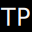

<br>
<p align="center">
  <a href="#">
    
  </a>

  <h3 align="center">Theoprovost.fr</h3>

  <p align="center">
    Personal portfolio
    <br />
    <a href="https://theoprovost.fr/">View Demo</a>
    ·
    <a href="https://github.com/theoprovost/theoprovost.fr/issues">Report Bug</a>
  </p>
</p>
<br>

<details>
  <summary>Table of Contents</summary>
  <ol>
    <li>
      <a href="#about-the-project">About The Project</a>
      <ul>
        <li><a href="#abstract">Abstract</a></li>
        <li><a href="#notable-features">Notable features</a></li>
        <li><a href="#built-with">Built with</a></li>
      </ul>
    </li>
    <li>
      <a href="#getting-started">Getting Started</a>
      <ul>
        <li><a href="#prerequisites">Prerequisites</a></li>
        <li><a href="#installation">Installation</a></li>
      </ul>
    </li>
    <li><a href="#contact">Contact</a></li>
  </ol>
</details>

## About the project

### Abstract

This project is my professional portfolio.

### Notable features

- Built from scratch (+ bootsrap)
- Completely responsive
- Uses GitHub's API

### Built with

|Backend|Frontend|Data|
|---|---|---|
|NodeJS|JavaScript|PostgreSQL|
|ExpressJS|EJS|GitHub API|
||Bootsrap|
||Sass|

This project has been published with Heroku.

## Getting Started
### Prerequisites
Before starting the project, make sure you have these installed :
- Node & NPM
- PostgreSQL

### Installation

Clone the repo :
```
cd ./the/path/of/your/choice
git cloclone git@github.com:theoprovost/theoprovost.fr.git
```
Launch the project :
```
cd ./repo
npm install
node index.js
```
You can also use `nodemon` :
```
nodemon index.js
```

## Contact
> Théo Provost @theoprovost - theo.provost@epitech.eu
